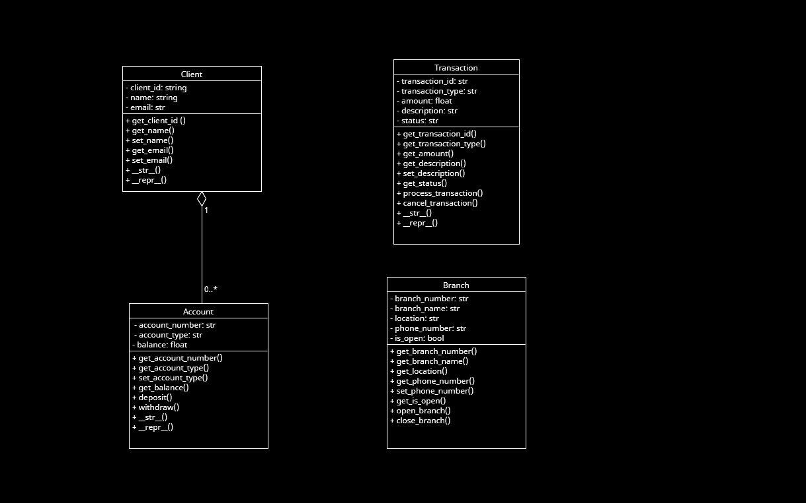

# Week 3 Workshop 3-1
I convert some public function to privacy function.
Create validation method
- Achieved Encapsulation.
- Used Isistance().
- Added Settere and Getter
- Drew a UML.

UML photo line:
